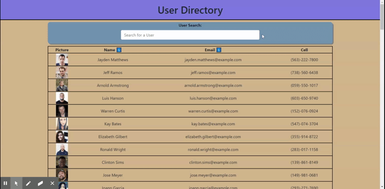

# Homework_19_User_Directory

## Table of Contents 

* [Description](#description)
* [Screenshot](#screenshot)
* [Questions](#questions)
* [License](#license)

## Description 

This application is designed to provide a user with the ability manage a user directory. The application is built using React.js which makes it dynamic on the front end.  They will be able to search for users by name as well as sort the users by Name or email.  

[Click Here](https://jared-user-directory.herokuapp.com/) to navigate to the live application. 

## Screenshot

## Questions

Please reach out to me if you have any questions.

GitHub User Profile - https://github.com/jrod3323

My Email Address - jrod3323@gmail.com

## License

This application is covered under the following license: General Public License.  For full description of the license please [Click Here](https://choosealicense.com/licenses/gpl-3.0/)
